# TIC-2023
Acest site vine în ajutorul elevilor care vor să se pregătească pentru olimpiada de TIC, sau pur și simplu a celor care vor să aprofundeze materia și nu știu unde să caute informația necesară.
# Prezentare Proiect
<h2>Pagina principală</h2>

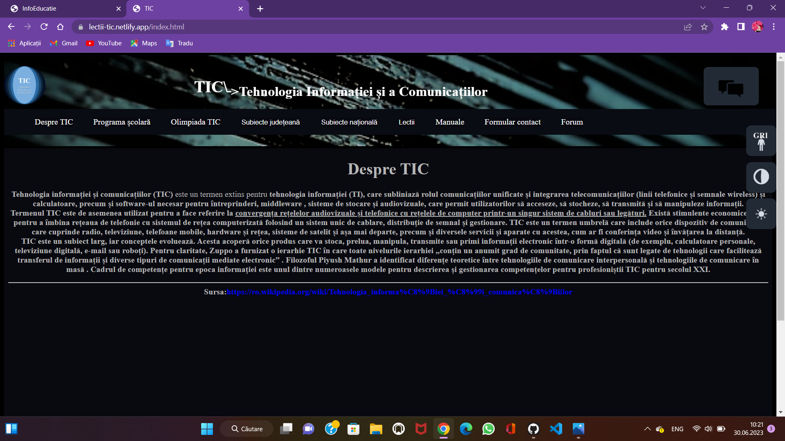
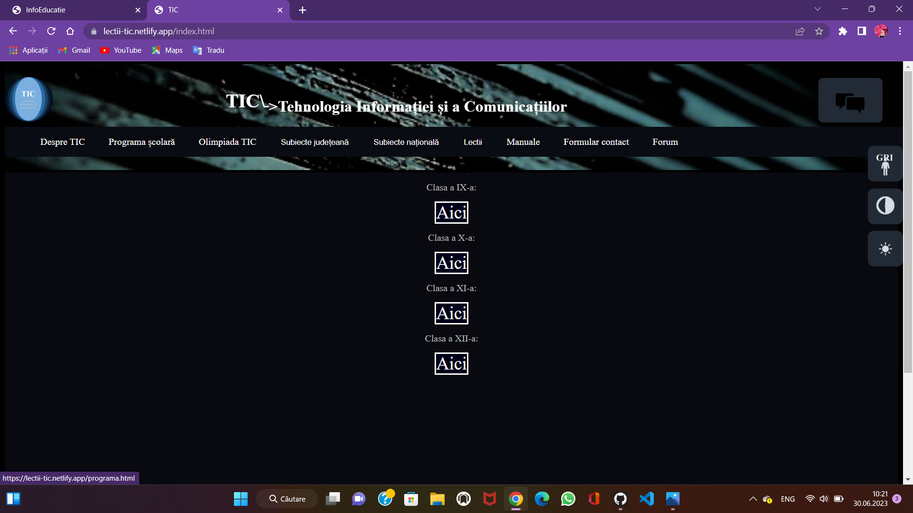
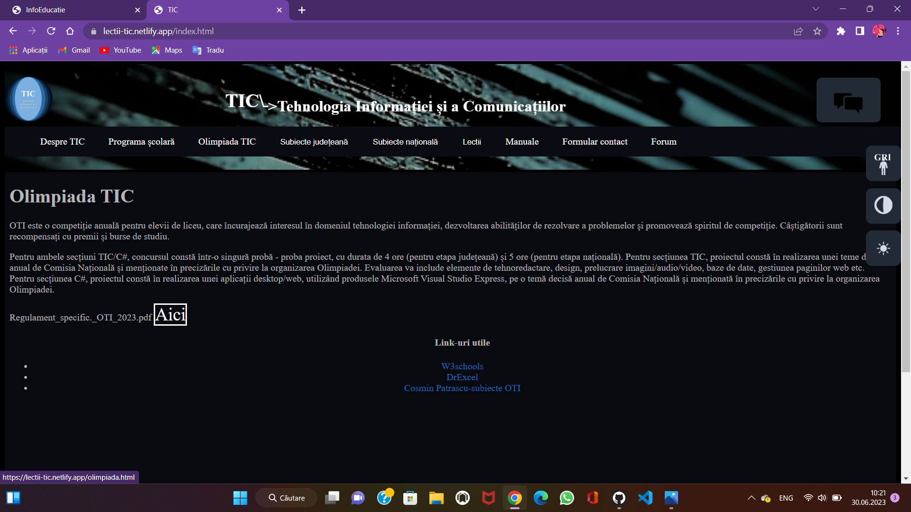

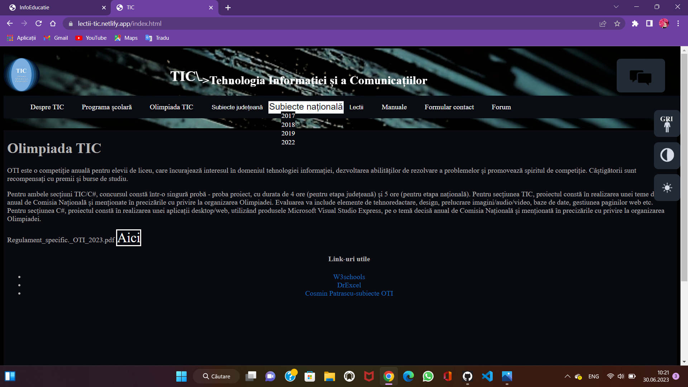
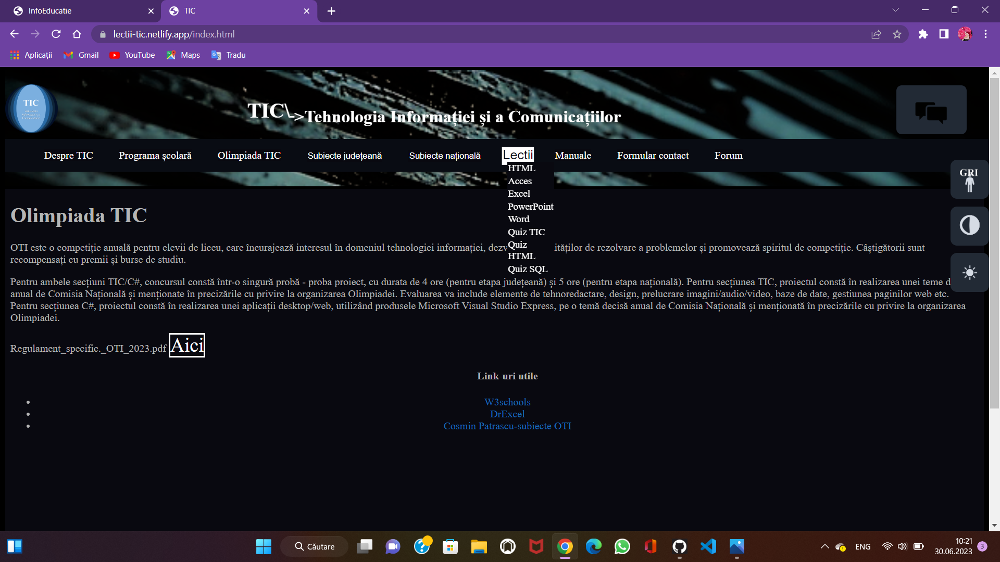
<h2>În cadrul lecțiilor se prezintă bazele materiei, care este structurată pe capitole pentru un acces mai ușor, și în cadrul fiecăreia, în partea stângă se află un buton care duce utilizatorul înapoi la meniu, lucru care facilitează procesul de învățare și căutare a informației</h2>
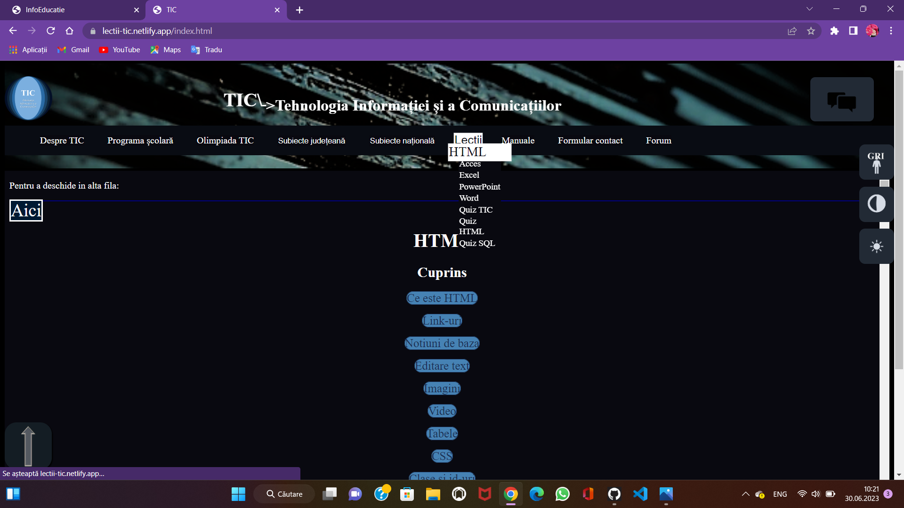
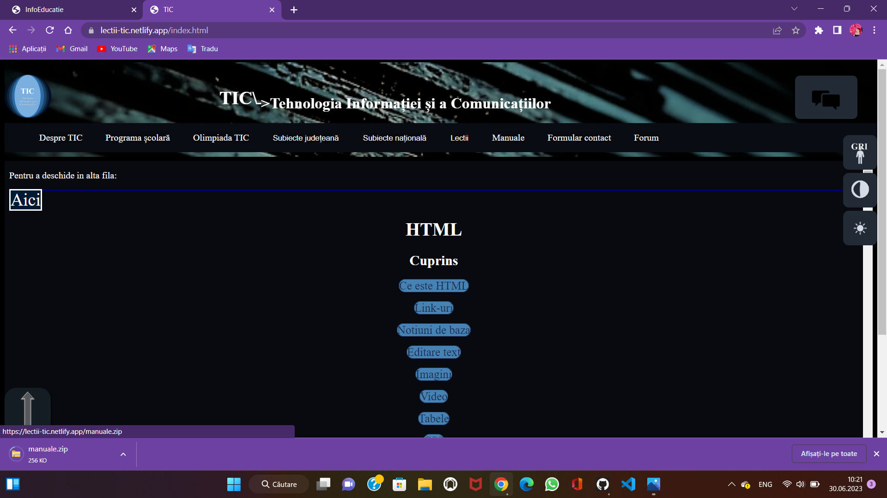
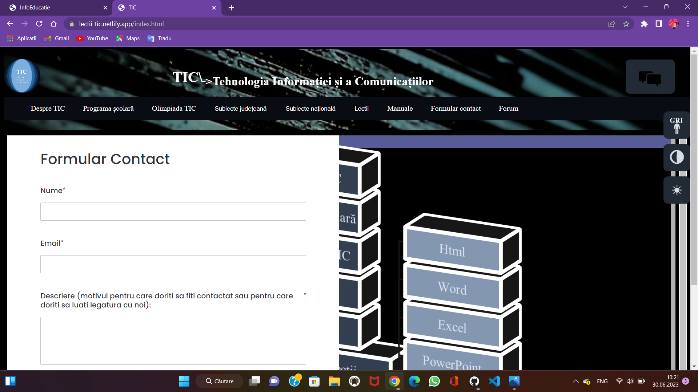
<h2>Se poate accesa forum-ul pentru a accesa resurse utile sau pentru a comunica cu alți studenți</h2>
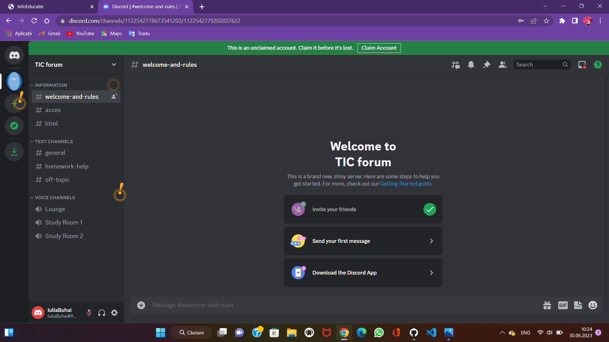
<h2>Asistentul virtual poate răspunde la intrebări de bază in ceea ce privește programarea in HTML și CSS </h2>
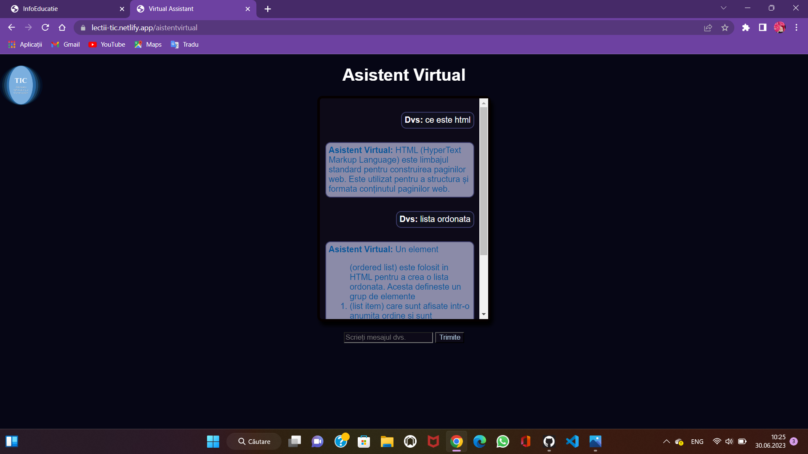
<h2>Pentru a face mai ușoară navigarea pe site a tuturor persoanelor, am introdus 3 opțiuni suplimentare la site-ul nostru, anume:</h2>
<ul>
  <li>posibilitatea de a elimina culorile</li>
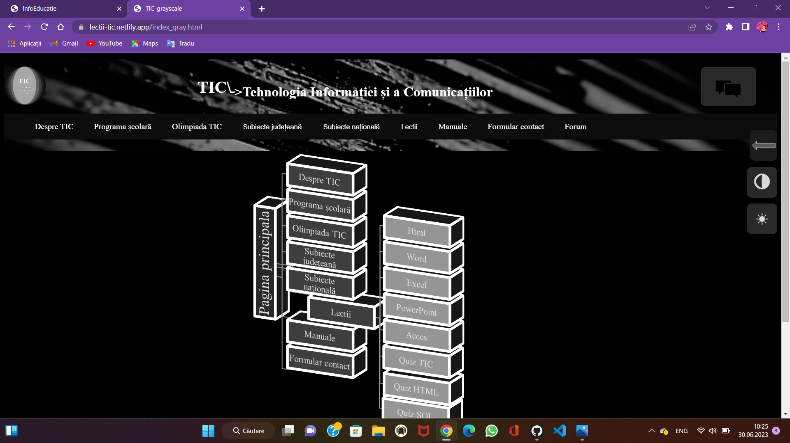
  <li>posibilitatea de a inversa culorile</li>
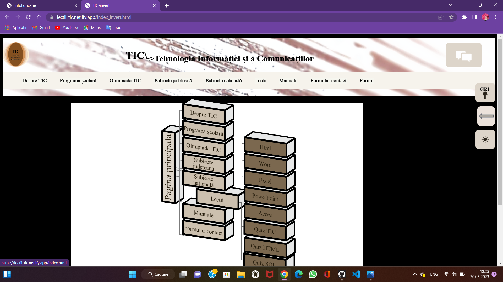
  <li>posibilitatea de a micșora luminozitatea</li>
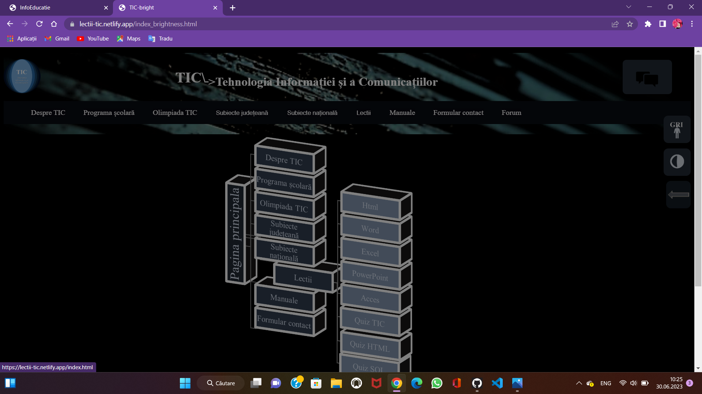
</ul>

# Realizare proiect
proiectul a fost realizat în :
<ul>
  <li>HTML</li>
  <li>CSS</li>
  <li>JavaScript</li>
</ul>

# Quizz-uri
Quizz-urile au fost realizate cu ajutorul unor platforme special dedicate pentru asta, în cadrul fiecărui quiz se află numele platformei utilizate.
Cele 2 platforme sunt: Typeform(Quiz TIC) Flexquiz(Quiz HTML si SQL).
# Formular contact
Formularul a fost realizat în cadrul platformei WorkForm
