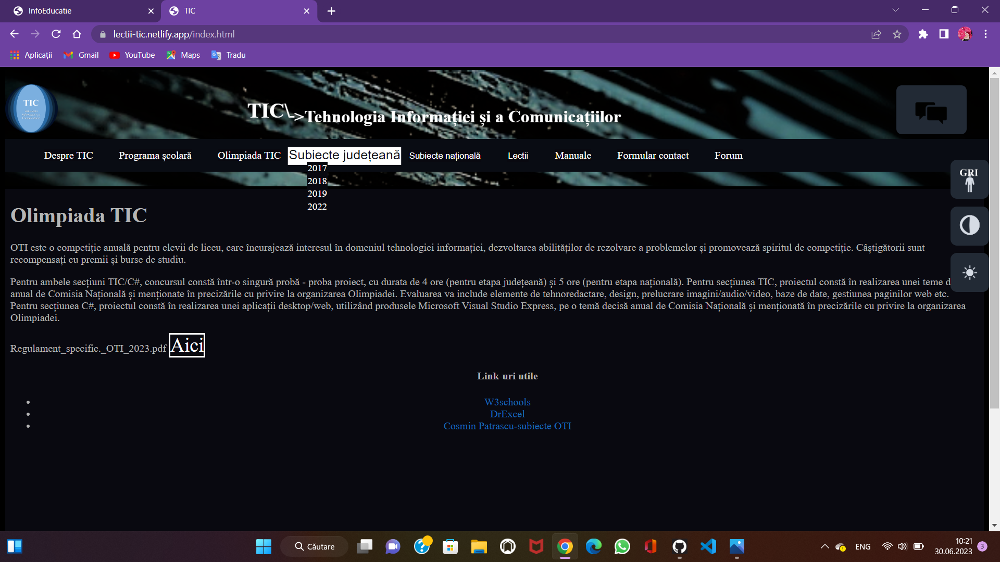

# TIC-2023
Acest site vine în ajutorul elevilor care vor să se pregătească pentru olimpiada de TIC, sau pur și simplu a celor care vor să aprofundeze materia și nu știu unde să caute informația necesară.
# Prezentare Proiect

# Realizare proiect
proiectul a fost realizat în :
<ul>
  <li>HTML</li>
  <li>CSS</li>
  <li>JavaScript</li>
</ul>

# Quizz-uri
Quizz-urile au fost realizate cu ajutorul unor platforme special dedicate pentru asta, în cadrul fiecărui quiz se află numele platformei utilizate.
Cele 2 platforme sunt: Typeform(Quiz TIC) Flexquiz(Quiz HTML si SQL).
# Formular contact
Formularul a fost realizat în cadrul platformei WorkForm
